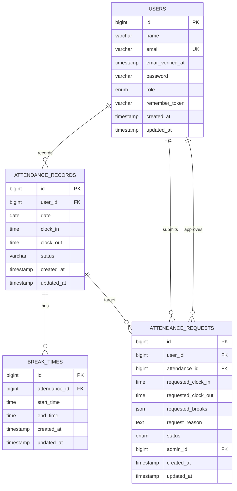

# ER Diagram

本ドキュメントは、勤怠管理システムの ER 図および関連テーブル構造をまとめたものです。

---

## 📘 ER 図（Mermaid）

```mermaid
erDiagram

    USERS ||--o{ ATTENDANCE_RECORDS : records
    USERS ||--o{ ATTENDANCE_REQUESTS : submits
    USERS ||--o{ ATTENDANCE_REQUESTS : approves

    ATTENDANCE_RECORDS ||--o{ BREAK_TIMES : has
    ATTENDANCE_RECORDS ||--o{ ATTENDANCE_REQUESTS : target

    USERS {
        bigint id PK
        varchar name
        varchar email UK
        timestamp email_verified_at
        varchar password
        enum role
        varchar remember_token
        timestamp created_at
        timestamp updated_at
    }

    ATTENDANCE_RECORDS {
        bigint id PK
        bigint user_id FK
        date date
        time clock_in
        time clock_out
        varchar status
        timestamp created_at
        timestamp updated_at
    }

    BREAK_TIMES {
        bigint id PK
        bigint attendance_id FK
        time start_time
        time end_time
        timestamp created_at
        timestamp updated_at
    }

    ATTENDANCE_REQUESTS {
        bigint id PK
        bigint user_id FK
        bigint attendance_id FK
        time requested_clock_in
        time requested_clock_out
        json requested_breaks
        text request_reason
        enum status
        bigint admin_id FK
        timestamp created_at
        timestamp updated_at
    }
```
